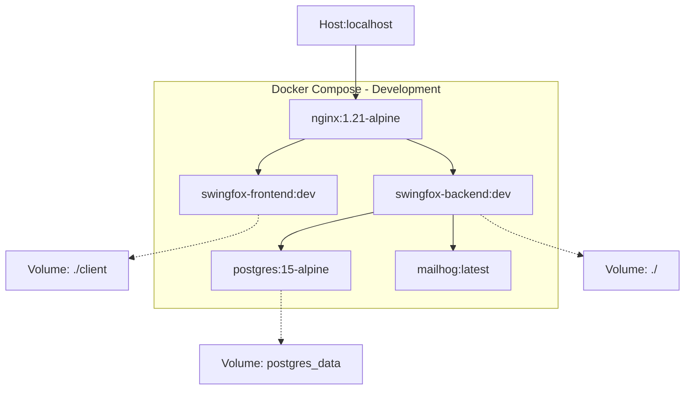

# Docker Development План для SwingFox

## 🎯 Цель
Создать полную Docker-конфигурацию для development окружения с hot reload, отладкой и простым запуском.

## 🏗️ Архитектура Docker Services



## 📦 Сервисы

### 1. Backend Service (Node.js)
**Файл**: `Dockerfile.backend.dev`
- **Базовый образ**: `node:18-alpine`
- **Рабочая директория**: `/app`
- **Порт**: `3001`
- **Команда**: `nodemon server.js`
- **Особенности**:
  - Volume mapping для hot reload
  - Установка nodemon глобально
  - Копирование package.json сначала для кэширования
  - Поддержка отладки через --inspect

### 2. Frontend Service (React)
**Файл**: `Dockerfile.frontend.dev`
- **Базовый образ**: `node:18-alpine`
- **Рабочая директория**: `/app`
- **Порт**: `443` (как указано в package.json)
- **Команда**: `npm run dev`
- **Особенности**:
  - Volume mapping для hot reload
  - Webpack dev server с HMR
  - Проксирование API на backend

### 3. Database Service (PostgreSQL)
**Образ**: `postgres:15-alpine`
- **Порт**: `5432`
- **База данных**: `swingfox`
- **Пользователь**: `postgres`
- **Пароль**: `root`
- **Особенности**:
  - Persistent volume для данных
  - Автоматическое создание БД
  - Health check

### 4. Email Service (MailHog)
**Образ**: `mailhog/mailhog:latest`
- **SMTP порт**: `1025`
- **Web интерфейс**: `8025`
- **Особенности**:
  - Перехват всех исходящих email
  - Web UI для просмотра писем

### 5. Nginx Proxy
**Образ**: `nginx:1.21-alpine`
- **Порт**: `80`
- **Особенности**:
  - Проксирование frontend (/)
  - Проксирование API (/api)
  - Проксирование статических файлов
  - Логирование

## 📁 Структура файлов

```
swingfox/
├── docker/
│   ├── backend/
│   │   ├── Dockerfile.dev
│   │   └── .dockerignore
│   ├── frontend/
│   │   ├── Dockerfile.dev
│   │   └── .dockerignore
│   └── nginx/
│       └── nginx.dev.conf
├── docker-compose.dev.yml
├── .env.docker.dev
└── README.DOCKER.md
```

## 🔧 Конфигурационные файлы

### docker-compose.dev.yml
```yaml
version: '3.8'

services:
  backend:
    build:
      context: .
      dockerfile: docker/backend/Dockerfile.dev
    ports:
      - "3001:3001"
      - "9229:9229"  # Debug port
    volumes:
      - .:/app
      - /app/node_modules
    environment:
      - NODE_ENV=development
      - DB_HOST=postgres
      - EMAIL_HOST=mailhog
    depends_on:
      - postgres
      - mailhog
    restart: unless-stopped

  frontend:
    build:
      context: ./client
      dockerfile: ../docker/frontend/Dockerfile.dev
    ports:
      - "443:443"
    volumes:
      - ./client:/app
      - /app/node_modules
    environment:
      - NODE_ENV=development
    restart: unless-stopped

  postgres:
    image: postgres:15-alpine
    ports:
      - "5432:5432"
    environment:
      - POSTGRES_DB=swingfox
      - POSTGRES_USER=postgres
      - POSTGRES_PASSWORD=root
    volumes:
      - postgres_data:/var/lib/postgresql/data
    restart: unless-stopped

  mailhog:
    image: mailhog/mailhog:latest
    ports:
      - "1025:1025"
      - "8025:8025"
    restart: unless-stopped

  nginx:
    image: nginx:1.21-alpine
    ports:
      - "80:80"
    volumes:
      - ./docker/nginx/nginx.dev.conf:/etc/nginx/nginx.conf
    depends_on:
      - frontend
      - backend
    restart: unless-stopped

volumes:
  postgres_data:
```

### .env.docker.dev
```env
# Database
DB_HOST=postgres
DB_USER=postgres
DB_PASSWORD=root
DB_NAME=swingfox
DB_PORT=5432

# JWT
JWT_SECRET=swingfox_jwt_secret_key_2024_docker
JWT_EXPIRES_IN=7d

# Email (MailHog)
EMAIL_HOST=mailhog
EMAIL_PORT=1025
EMAIL_USER=
EMAIL_PASSWORD=
EMAIL_FROM=info@swingfox.ru

# Server
PORT=3001
NODE_ENV=development

# Files
UPLOAD_PATH=public/uploads
MAX_FILE_SIZE=10485760
```

## 🚀 Команды для запуска

### Первый запуск
```bash
# Сборка образов
docker-compose -f docker-compose.dev.yml build

# Запуск всех сервисов
docker-compose -f docker-compose.dev.yml up

# Выполнение миграций
docker-compose -f docker-compose.dev.yml exec backend npm run migrate
```

### Ежедневное использование
```bash
# Запуск в фоне
docker-compose -f docker-compose.dev.yml up -d

# Просмотр логов
docker-compose -f docker-compose.dev.yml logs -f

# Остановка
docker-compose -f docker-compose.dev.yml down
```

## 🔍 URL для доступа

- **Приложение**: http://localhost
- **API**: http://localhost/api
- **Frontend Dev Server**: https://localhost:443
- **Backend**: http://localhost:3001
- **MailHog UI**: http://localhost:8025
- **PostgreSQL**: localhost:5432

## 🐛 Отладка

### Backend Debug
```bash
# Подключение к контейнеру
docker-compose -f docker-compose.dev.yml exec backend bash

# Просмотр логов
docker-compose -f docker-compose.dev.yml logs backend

# Debug через VS Code - настроить launch.json для attach к порту 9229
```

### Frontend Debug
```bash
# Установка дополнительных пакетов
docker-compose -f docker-compose.dev.yml exec frontend npm install package-name

# Rebuild без cache
docker-compose -f docker-compose.dev.yml build --no-cache frontend
```

## 📊 Health Checks

```yaml
# Добавить в docker-compose.dev.yml для каждого сервиса
healthcheck:
  test: ["CMD", "curl", "-f", "http://localhost:3001/api/status"]
  interval: 30s
  timeout: 10s
  retries: 3
  start_period: 40s
```

## 🔧 Volume Strategy

### Development Volumes
- **Source Code**: Полный mapping для hot reload
- **node_modules**: Анонимные volumes для избежания конфликтов
- **Database**: Named volume для persistent данных
- **Uploads**: Mapping для сохранения файлов

## 🏁 Next Steps

1. ✅ Создать все Dockerfile'ы
2. ✅ Настроить docker-compose.dev.yml  
3. ✅ Создать nginx конфигурацию
4. ✅ Настроить .dockerignore файлы
5. ✅ Создать .env.docker.dev
6. ✅ Написать документацию README.DOCKER.md
7. ✅ Тестирование полного стека