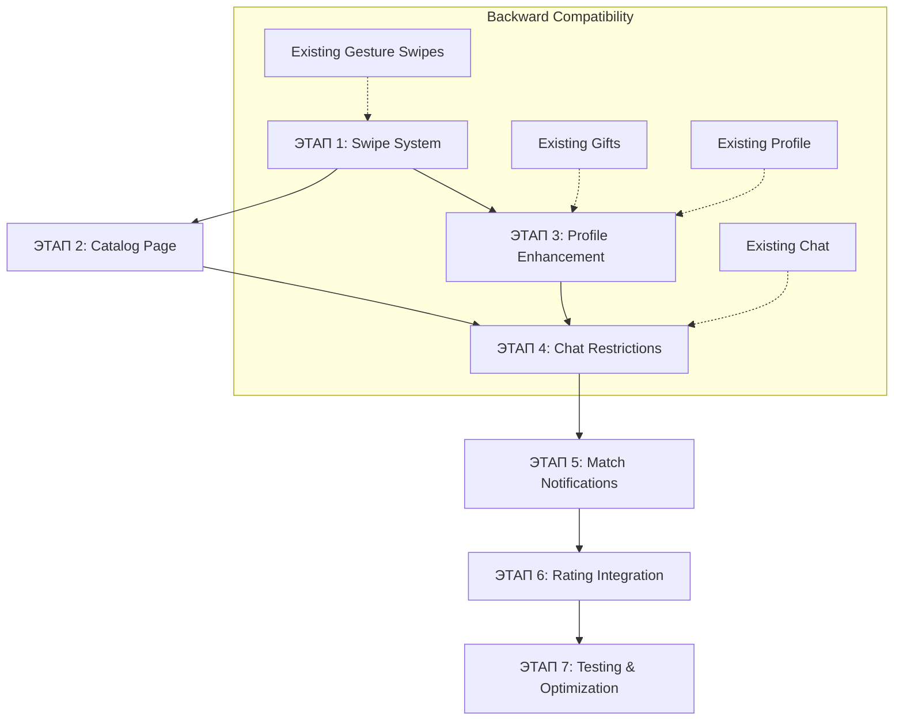

# SwingFox Migration Architecture Plan

## Обзор проблем

После анализа PHP версии (`public_html/`) и текущей Node.js реализации выявлены критические архитектурные несоответствия:

### Основные проблемы:
1. **Система свайпов** - отсутствуют кнопки лайк/дизлайк из PHP версии
2. **Система чата** - нет ограничений доступа (должен быть только после взаимных лайков)
3. **Страница каталога** - отсутствует просмотр всех анкет с фильтрами
4. **Система подарков** - неправильно размещена в интерфейсе свайпов вместо профилей
5. **Лайки фотографий** - отсутствует система оценки отдельных фото, влияющая на рейтинг
6. **Перегруженный UI чата** - требует упрощения

## Архитектура миграции (7 этапов)

### ЭТАП 1: Расширение системы свайпов
**Цель**: Добавить кнопки лайк/дизлайк без нарушения существующей gesture-логики

**Файлы для изменения**:
- `client/src/pages/Home.js` (строки 432-693) - расширить ActionButtons компонент
- `src/routes/swipe.js` (строки 1-627) - добавить параллельные API endpoints

**Backward Compatibility**: 
- Сохранить все существующие gesture handlers
- Добавить новые button handlers параллельно
- Использовать те же API endpoints с дополнительным параметром `source`

### ЭТАП 2: Создание страницы каталога
**Цель**: Независимая страница для просмотра всех анкет с фильтрами

**Новые файлы**:
- `client/src/pages/Catalog.js` - новая страница каталога
- `src/routes/catalog.js` - backend для каталога

**Референс**: `public_html/acquaintances.php` - система фильтров по стране/городу/возрасту

**Backward Compatibility**: Полностью независимый модуль, не влияет на существующие страницы

### ЭТАП 3: Улучшение системы профилей
**Цель**: Интеграция лайков фотографий и системы подарков в профили

**Файлы для изменения**:
- `client/src/pages/Profile.js` - добавить лайки фото и отправку подарков
- `migrations/20241217000010-create-image-likes.js` - использовать готовую миграцию
- `client/src/pages/Gifts.js` (строки 1-666) - рефакторинг под профили

**Backward Compatibility**: Существующая страница подарков остается рабочей

### ЭТАП 4: Модификация чата
**Цель**: Добавить middleware проверки взаимных лайков + упростить UI

**Файлы для изменения**:
- `src/routes/chat.js` (строки 1-949) - добавить middleware проверки
- `client/src/pages/Chat.js` (строки 1-830) - упростить интерфейс

**Backward Compatibility**: Сохранить всю функциональность, добавить только проверки доступа

### ЭТАП 5: Система уведомлений о мэтчах
**Цель**: Модальные окна уведомлений о новых мэтчах

**Новые компоненты**:
- `client/src/components/MatchModal.js` - модальное окно мэтча
- Интеграция в существующие swipe и catalog страницы

**Backward Compatibility**: Дополнительная функциональность, не влияет на основную логику

### ЭТАП 6: Интеграция рейтинговой системы
**Цель**: Алгоритм рейтинга на основе лайков фото + профиля + сообщений

**Файлы для изменения**:
- `src/routes/rating.js` - расширить алгоритм
- Интеграция в recommendation системы

**Backward Compatibility**: Использует существующие данные, добавляет новые критерии

### ЭТАП 7: Финальное тестирование
**Цель**: Комплексное тестирование всех систем и оптимизация производительности

## Диаграмма архитектуры

## Принципы реализации

### 1. Независимость этапов
Каждый этап может быть разработан и протестирован отдельно без влияния на другие системы.

### 2. Обратная совместимость
- Все существующие API endpoints остаются рабочими
- UI компоненты расширяются, но не заменяются полностью
- Пользовательский опыт остается непрерывным

### 3. Поэтапное тестирование
- Каждый этап включает unit и integration тесты
- Production deployment возможен после любого завершенного этапа
- Rollback план для каждого этапа

### 4. Производительность
- Новая функциональность не влияет на скорость существующих операций
- Оптимизация database queries при добавлении новых индексов
- Lazy loading для новых компонентов

## Критические точки

### PHP vs Node.js Logic Mapping
- **Mutual Likes**: `public_html/main.php` строки 150-200 → `src/routes/chat.js` middleware
- **Button Swipes**: `public_html/script.js` строки 300-400 → `client/src/pages/Home.js` ActionButtons
- **Image Likes**: `public_html/script.js` строки 800-900 → новый компонент в Profile
- **Gift Integration**: `public_html/main.php` строки 1200-1300 → `client/src/pages/Profile.js`

### Database Schema
- Использовать существующие таблицы: `users`, `user_likes`, `messages`, `gifts`
- Добавить новые через готовые миграции: `image_likes`
- Расширить индексы для производительности новых запросов

### API Consistency
- Сохранить все существующие endpoints
- Добавить новые с префиксом `/v2/` при необходимости
- Использовать middleware для backward compatibility

## Заключение

Данная архитектура обеспечивает:
- **Безопасную миграцию** без downtime
- **Поэтапную реализацию** с возможностью rollback
- **Полную обратную совместимость** со всеми существующими системами
- **Масштабируемость** для будущих улучшений

Каждый этап может быть реализован независимо, что позволяет распределить работу и минимизировать риски.