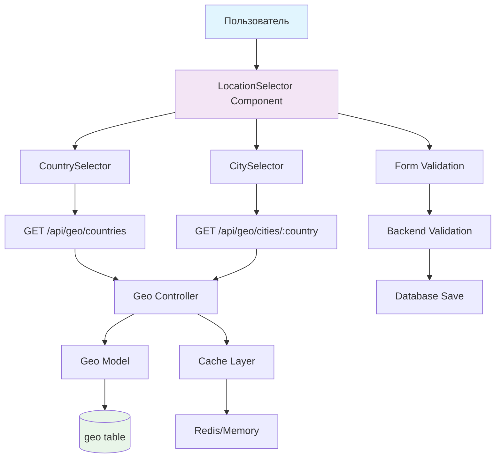

# Анализ и рекомендации по системе выбора стран/городов в SwingFox

## 📊 Сравнительный анализ

### PHP версия (Legacy)
✅ **Преимущества:**
- **Структурированная база данных**: Таблица `geo` с ~11,000 записей глобальных географических данных
- **Иерархический выбор**: Страна → Регион → Город с динамической подгрузкой
- **AJAX автодополнение**: Функция `getGeo()` с живым поиском через `datalist`
- **Валидация данных**: Пользователи могут выбирать только существующие места
- **Единообразие**: Консистентные географические данные по всему приложению

❌ **Недостатки:**
- Устаревшая технология (jQuery + PHP)
- Синхронные AJAX запросы
- Отсутствие типизации

### JavaScript версия (Current) 
❌ **Проблемы:**
- **Отсутствие geo таблицы**: Нет структурированных географических данных
- **Простые text input**: Возможность ввода любого текста, включая опечатки
- **Отсутствие валидации**: Несуществующие места, неконсистентные данные
- **Плохой UX**: Пользователи должны вводить все вручную
- **Потеря функциональности**: Значительное снижение качества по сравнению с PHP версией

## 🎯 Текущие места использования country/city

### 1. Регистрация ([`client/src/pages/Register.js`](client/src/pages/Register.js:1024))
```javascript
// Строки 1013-1030: Простые text input без валидации
<Input {...register('country')} placeholder="Россия" />
<Input {...register('city', { required: 'Город обязателен' })} placeholder="Ваш город" />
```

### 2. Профиль ([`client/src/pages/Profile.js`](client/src/pages/Profile.js:577))
```javascript  
// Строки 577-581: Текстовое поле города
<Input {...register('city', { required: 'Город обязателен' })} placeholder="Ваш город" />
```

### 3. Объявления ([`client/src/pages/Ads.js`](client/src/pages/Ads.js:714))
```javascript
// Строки 567-569: Фильтр по городу
<Input placeholder="Введите название города..." value={filters.city} />
// Строки 714-718: Создание объявления
<Input {...register('city', { required: 'Город обязателен' })} placeholder="В каком городе?" />
```

### 4. База данных
**Таблицы с географическими полями:**
- [`users`](migrations/20241217000001-create-users.js:38) (строки 38-44): `country TEXT`, `city TEXT`
- [`ads`](migrations/20241217000004-create-ads.js:25) (строки 25-31): `country TEXT`, `city TEXT`  
- [`events`](migrations/20241217000008-create-events.js:38) (строка 38): `city STRING(100)`

## 📈 Рекомендации по улучшению

### Этап 1: Создание географической инфраструктуры

#### 1.1 Миграция geo таблицы
```javascript
// migrations/20241218000001-create-geo.js
await queryInterface.createTable('geo', {
  id: {
    type: Sequelize.INTEGER,
    primaryKey: true,
    autoIncrement: true
  },
  country: {
    type: Sequelize.STRING(100),
    allowNull: false
  },
  region: {
    type: Sequelize.STRING(100),
    allowNull: true
  },
  city: {
    type: Sequelize.STRING(100),
    allowNull: false
  }
}, {
  indexes: [
    { fields: ['country'] },
    { fields: ['country', 'region'] },
    { fields: ['country', 'city'] }
  ]
});
```

#### 1.2 API эндпоинты для географических данных
```javascript
// src/routes/geo.js
router.get('/countries', async (req, res) => {
  const countries = await Geo.findAll({
    attributes: ['country'],
    group: ['country'],
    order: [['country', 'ASC']]
  });
  res.json(countries);
});

router.get('/cities/:country', async (req, res) => {
  const cities = await Geo.findAll({
    where: { country: req.params.country },
    attributes: ['city'],
    order: [['city', 'ASC']]
  });
  res.json(cities);
});
```

### Этап 2: Frontend компоненты

#### 2.1 Компонент CountrySelector
```jsx
// client/src/components/CountrySelector.js
import { useState, useEffect } from 'react';

const CountrySelector = ({ value, onChange, error }) => {
  const [countries, setCountries] = useState([]);
  const [isLoading, setIsLoading] = useState(false);
  
  useEffect(() => {
    fetchCountries();
  }, []);
  
  const fetchCountries = async () => {
    setIsLoading(true);
    try {
      const response = await fetch('/api/geo/countries');
      const data = await response.json();
      setCountries(data);
    } catch (error) {
      console.error('Ошибка загрузки стран:', error);
    } finally {
      setIsLoading(false);
    }
  };
  
  return (
    <Select
      value={value}
      onChange={onChange}
      loading={isLoading}
      placeholder="Выберите страну"
      showSearch
      filterOption={(input, option) =>
        option?.children?.toLowerCase().includes(input.toLowerCase())
      }
      className={error ? 'error' : ''}
    >
      {countries.map(country => (
        <Option key={country.country} value={country.country}>
          {country.country}
        </Option>
      ))}
    </Select>
  );
};
```

#### 2.2 Компонент CitySelector
```jsx
// client/src/components/CitySelector.js
const CitySelector = ({ country, value, onChange, error }) => {
  const [cities, setCities] = useState([]);
  const [isLoading, setIsLoading] = useState(false);
  
  useEffect(() => {
    if (country) {
      fetchCities(country);
    } else {
      setCities([]);
    }
  }, [country]);
  
  const fetchCities = async (selectedCountry) => {
    setIsLoading(true);
    try {
      const response = await fetch(`/api/geo/cities/${selectedCountry}`);
      const data = await response.json();
      setCities(data);
    } catch (error) {
      console.error('Ошибка загрузки городов:', error);
    } finally {
      setIsLoading(false);
    }
  };
  
  return (
    <Select
      value={value}
      onChange={onChange}
      loading={isLoading}
      placeholder={country ? "Выберите город" : "Сначала выберите страну"}
      disabled={!country}
      showSearch
      filterOption={(input, option) =>
        option?.children?.toLowerCase().includes(input.toLowerCase())
      }
      className={error ? 'error' : ''}
    >
      {cities.map(city => (
        <Option key={city.city} value={city.city}>
          {city.city}
        </Option>
      ))}
    </Select>
  );
};
```

#### 2.3 Композитный компонент LocationSelector
```jsx
// client/src/components/LocationSelector.js
const LocationSelector = ({ 
  countryValue, 
  cityValue, 
  onCountryChange, 
  onCityChange,
  countryError,
  cityError,
  required = false 
}) => {
  const handleCountryChange = (newCountry) => {
    onCountryChange(newCountry);
    // Сбрасываем город при смене страны
    if (cityValue) {
      onCityChange('');
    }
  };
  
  return (
    <FormGroup>
      <Label>
        Страна {required && <span className="required">*</span>}
      </Label>
      <CountrySelector
        value={countryValue}
        onChange={handleCountryChange}
        error={countryError}
      />
      {countryError && <ErrorText>{countryError}</ErrorText>}
      
      <Label>
        Город {required && <span className="required">*</span>}
      </Label>
      <CitySelector
        country={countryValue}
        value={cityValue}
        onChange={onCityChange}
        error={cityError}
      />
      {cityError && <ErrorText>{cityError}</ErrorText>}
    </FormGroup>
  );
};
```

### Этап 3: Интеграция в существующие формы

#### 3.1 Обновление Register.js
```jsx
// Заменить строки 1012-1031
<LocationSelector
  countryValue={watch('country')}
  cityValue={watch('city')}
  onCountryChange={(value) => setValue('country', value)}
  onCityChange={(value) => setValue('city', value)}
  countryError={errors.country?.message}
  cityError={errors.city?.message}
  required={true}
/>
```

#### 3.2 Обновление Profile.js
```jsx
// Заменить строку 577-581
<LocationSelector
  countryValue={watch('country')}
  cityValue={watch('city')}
  onCountryChange={(value) => setValue('country', value)}
  onCityChange={(value) => setValue('city', value)}
  cityError={errors.city?.message}
  required={true}
/>
```

#### 3.3 Обновление Ads.js
```jsx
// Заменить строки 714-718 (создание)
<LocationSelector
  countryValue={watch('country')}
  cityValue={watch('city')}
  onCountryChange={(value) => setValue('country', value)}
  onCityChange={(value) => setValue('city', value)}
  cityError={errors.city?.message}
  required={true}
/>

// Заменить строки 567-569 (фильтр)
<LocationSelector
  countryValue={filters.country}
  cityValue={filters.city}
  onCountryChange={(value) => setFilters(prev => ({ ...prev, country: value }))}
  onCityChange={(value) => setFilters(prev => ({ ...prev, city: value }))}
  required={false}
/>
```

### Этап 4: Миграция данных

#### 4.1 Скрипт импорта данных из PHP версии
```javascript
// scripts/import-geo-data.js
const fs = require('fs');
const { Geo } = require('../src/models');

async function importGeoData() {
  try {
    // Читаем SQL файл PHP версии
    const sqlData = fs.readFileSync('./public_html/kolomigs_swing.sql', 'utf8');
    
    // Извлекаем данные geo таблицы (строки 206-11193)
    const geoMatches = sqlData.match(/INSERT INTO `geo` VALUES \((.*?)\);/g);
    
    const geoData = [];
    geoMatches.forEach(match => {
      const values = match.match(/\('([^']+)','([^']+)','([^']+)'\)/g);
      values.forEach(value => {
        const [, country, region, city] = value.match(/\('([^']+)','([^']+)','([^']+)'\)/);
        geoData.push({ country, region, city });
      });
    });
    
    // Батчевая вставка в новую БД
    await Geo.bulkCreate(geoData, { ignoreDuplicates: true });
    
    console.log(`Импортировано ${geoData.length} географических записей`);
  } catch (error) {
    console.error('Ошибка импорта географических данных:', error);
  }
}

importGeoData();
```

### Этап 5: Дополнительные улучшения

#### 5.1 Кэширование на клиенте
```javascript
// client/src/hooks/useGeoCache.js
const useGeoCache = () => {
  const CACHE_DURATION = 24 * 60 * 60 * 1000; // 24 часа
  
  const getCachedData = (key) => {
    const cached = localStorage.getItem(`geo_${key}`);
    if (cached) {
      const { data, timestamp } = JSON.parse(cached);
      if (Date.now() - timestamp < CACHE_DURATION) {
        return data;
      }
    }
    return null;
  };
  
  const setCachedData = (key, data) => {
    localStorage.setItem(`geo_${key}`, JSON.stringify({
      data,
      timestamp: Date.now()
    }));
  };
  
  return { getCachedData, setCachedData };
};
```

#### 5.2 Валидация на бэкенде
```javascript
// src/middleware/validateGeo.js
const validateGeoData = async (req, res, next) => {
  const { country, city } = req.body;
  
  if (country && city) {
    const geoExists = await Geo.findOne({
      where: { country, city }
    });
    
    if (!geoExists) {
      return res.status(400).json({
        error: 'Указанная комбинация страны и города не найдена'
      });
    }
  }
  
  next();
};
```

## 🚀 План реализации

### Фаза 1 (1-2 недели): Инфраструктура
- [ ] Создать миграцию geo таблицы
- [ ] Импортировать данные из PHP версии  
- [ ] Создать API эндпоинты
- [ ] Настроить индексы для производительности

### Фаза 2 (1 неделя): Frontend компоненты
- [ ] Создать CountrySelector компонент
- [ ] Создать CitySelector компонент
- [ ] Создать LocationSelector композитный компонент
- [ ] Добавить стили и анимации

### Фаза 3 (1 неделя): Интеграция
- [ ] Обновить форму регистрации
- [ ] Обновить страницу профиля
- [ ] Обновить страницу объявлений
- [ ] Добавить фильтры в поиск

### Фаза 4 (0.5 недели): Оптимизация
- [ ] Добавить кэширование
- [ ] Добавить валидацию
- [ ] Тестирование производительности
- [ ] Мобильная оптимизация

## 📊 Ожидаемые результаты

### Улучшения UX:
- ✅ Удобный выбор географических данных
- ✅ Автодополнение и поиск
- ✅ Валидация существующих мест
- ✅ Консистентность данных

### Технические преимущества:  
- ✅ Структурированные географические данные
- ✅ Оптимизированные запросы с индексами
- ✅ Кэширование для производительности
- ✅ Типизация и валидация

### Качество данных:
- ✅ Отсутствие опечаток и дубликатов
- ✅ Единообразие географических названий
- ✅ Возможность аналитики по регионам
- ✅ Поддержка будущих геофич

## 🔗 Диаграмма архитектуры



## 💡 Заключение

Текущая реализация географических данных в JavaScript версии значительно уступает PHP версии по функциональности и пользовательскому опыту. Предложенные улучшения позволят:

1. **Восстановить функциональность** PHP версии в современном формате
2. **Улучшить UX** за счет автодополнения и валидации  
3. **Повысить качество данных** через структурированное хранение
4. **Подготовить основу** для будущих географических функций

Рекомендуется начать реализацию с создания инфраструктуры (Фаза 1), так как это критически важно для качества данных в приложении знакомств.