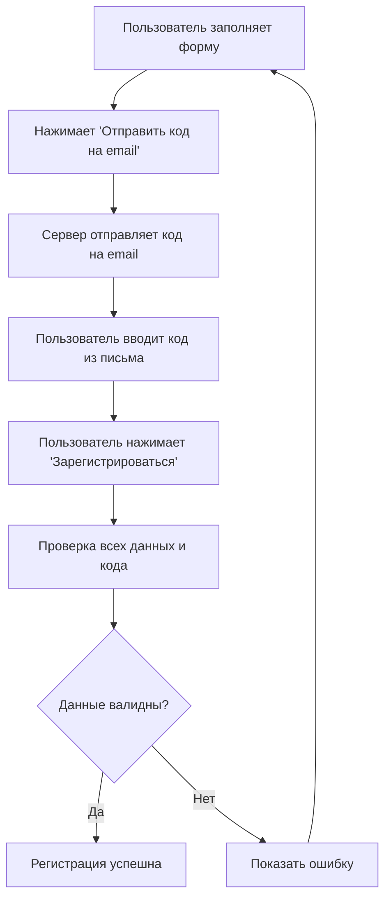

# План исправления регистрации SwingFox

## Анализ проблемы
Ошибка "Bad Request" (400) возникает из-за несоответствия структуры данных между клиентом и сервером.

### Ожидаемая структура сервера
```javascript
{
  email: "string",
  mail_code: "string", // код подтверждения из email
  login: "string", 
  password: "string",
  about: {
    status: "string",
    country: "string", 
    city: "string",
    search_status: "string",
    search_age: "string", 
    location: "string",
    mobile: "string",
    info: "string"
  },
  individual: {
    date: "string", // дата рождения
    height: "string",
    weight: "string", 
    smoking: "string",
    alko: "string"
  }
}
```

### Текущая структура клиента
```javascript
{
  login: "string",
  email: "string", 
  password: "string",
  confirmPassword: "string",
  status: "string", // должно быть в about.status
  birthday: "string", // должно быть в individual.date
  city: "string", // должно быть в about.city
  info: "string" // должно быть в about.info
}
```

## Необходимые изменения

### 1. Добавить этап email подтверждения
- Кнопка "Отправить код на email"
- Поле ввода кода подтверждения
- Таймер повторной отправки (120 сек)
- Валидация кода перед регистрацией

### 2. Расширить форму недостающими полями

#### Блок "О себе" (about)
- ✅ Статус (уже есть)
- ➕ Страна 
- ✅ Город (уже есть)
- ➕ Кого ищете (search_status)
- ➕ Возрастной диапазон поиска (search_age)
- ➕ Локация (location)
- ➕ Мобильный телефон (mobile)
- ✅ О себе (info) (уже есть)

#### Блок "Личные данные" (individual)  
- ✅ Дата рождения (birthday → date)
- ➕ Рост (height)
- ➕ Вес (weight)
- ➕ Отношение к курению (smoking)
- ➕ Отношение к алкоголю (alko)

### 3. Исправить структуру отправляемых данных
```javascript
const submitData = {
  email: data.email,
  mail_code: emailCode,
  login: data.login, 
  password: data.password,
  about: {
    status: selectedStatus,
    country: data.country,
    city: data.city,
    search_status: data.searchStatus,
    search_age: data.searchAge,
    location: data.location,
    mobile: data.mobile,
    info: data.info
  },
  individual: {
    date: data.birthday,
    height: data.height,
    weight: data.weight,
    smoking: data.smoking,
    alko: data.alko
  }
};
```

## Процесс регистрации



## Опции для полей

### Статус отношений
- single_man - Одинокий мужчина
- single_woman - Одинокая женщина  
- couple_mf - Пара М+Ж
- couple_mm - Пара М+М
- couple_ff - Пара Ж+Ж
- open_relationship - Открытые отношения

### Кого ищете (search_status)
- single_man - Одинокого мужчину
- single_woman - Одинокую женщину
- couple_mf - Пару М+Ж
- couple_mm - Пару М+М  
- couple_ff - Пару Ж+Ж
- any - Любых

### Возрастной диапазон (search_age)
- 18-25, 25-30, 30-35, 35-40, 40-45, 45-50, 50+

### Отношение к курению (smoking)
- never - Не курю
- sometimes - Иногда
- regular - Регулярно
- no_matter - Не важно

### Отношение к алкоголю (alko)
- never - Не пью
- sometimes - Иногда
- regular - Регулярно  
- no_matter - Не важно

## Следующие шаги
1. Переписать компонент Register.js с новой структурой
2. Добавить все недостающие поля
3. Реализовать логику email подтверждения
4. Обновить валидацию
5. Протестировать процесс регистрации